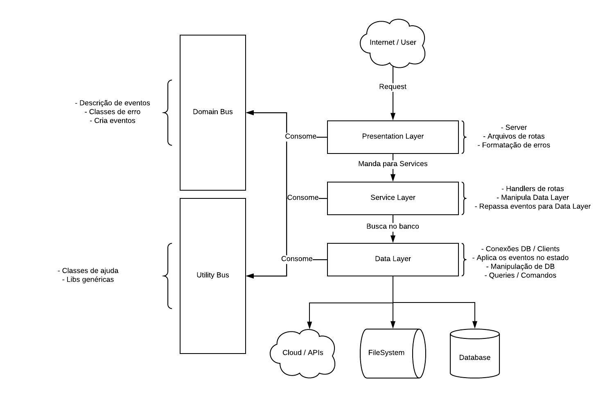

# Sobre a arquitetura de código

<!-- TOC -->

- [Sobre a arquitetura de código](#sobre-a-arquitetura-de-código)
  - [Estrutura de pastas](#estrutura-de-pastas)
  - [Camada de apresentação](#camada-de-apresentação)
  - [Camada de Serviço](#camada-de-serviço)
  - [Camada de dados](#camada-de-dados)
    - [Conexões](#conexões)
    - [Repositórios](#repositórios)
  - [Coluna de domínio](#coluna-de-domínio)
  - [Coluna de utilidades](#coluna-de-utilidades)

<!-- /TOC -->

Estamos utilizando o modelo baseado em *Domain Driven Design*, com ou sem [Event Sourcing](https://martinfowler.com/eaaDev/EventSourcing.html).

Este modelo se baseia em 3 camadas base que se comunicam de forma *top-down*, ou seja, a camada mais superior irá interagir com a mais inferior, mas nunca o contrário.

Todo o cenário é baseado na imagem a seguir:



## Estrutura de pastas

A estrutura de pastas seguirá o modelo abaixo, mas você pode checar em tempo real acessando o [diretório de exemplo](../folder-structure):

```
project-x
├── Dockerfile
├── app-config.ts
├── ci-config.yaml
├── desktop.ini
├── package.json
└── src
    ├── data
    │   ├── connections
    │   │   ├── mongo.ts
    │   │   └── sql-server.ts
    │   └── repositories
    │       ├── entity-x.ts
    │       └── entity-y.ts
    ├── domain
    │   ├── domain-base.error.ts
    │   ├── entity-x
    │   │   ├── entity.ts
    │   │   ├── errors
    │   │   │   └── EntityXError.ts
    │   │   ├── events
    │   │   │   ├── entity-x-was-created.ts
    │   │   │   ├── entity-x-was-deleted.ts
    │   │   │   ├── entity-x-was-finished.ts
    │   │   │   └── entity-x-was-updated.ts
    │   │   └── structures
    │   │       ├── enums
    │   │       │   └── Data.ts
    │   │       └── interfaces
    │   │           ├── IData.ts
    │   │           └── IFilter.ts
    │   ├── entity-y
    │   │   ├── entity.ts
    │   │   ├── errors
    │   │   │   └── EntityYError.ts
    │   │   ├── events
    │   │   │   ├── entity-y-was-created.ts
    │   │   │   └── entity-y-was-updated.ts
    │   │   └── structures
    │   │       ├── enums
    │   │       │   └── Data.ts
    │   │       └── interfaces
    │   │           ├── IData.ts
    │   │           └── IFilter.ts
    │   └── index.ts
    ├── index.ts
    ├── libs
    │   ├── cpf-validator.ts
    │   └── helper-abc.ts
    ├── presentation
    │   ├── app.ts
    │   ├── routes
    │   │   ├── route-a.ts
    │   │   └── route-b.ts
    │   └── server.ts
    └── services
        ├── entity-x.ts
        └── entity-y.ts
```

- `project-x`: É a pasta inicial que vai conter o nome do projeto, tudo estará dentro desta pasta
  - **Arquivos de estrutura**: Abaixo da raiz, no primeiro nível, vamos ter os dotfiles necessários para configuração de CI/CD, Docker e outras informações; aqui será aonde vamos ter o `package.json` e o `tsconfig.json`
  - `.env` ou `.envrc`: Variáveis de ambiente devem ficar em um arquivo `.envrc` para **execução local**, toda a execução em imagem teremos um CI que vai passar as variáveis de ambiente para o container. Todo `.envrc` deve ter um `.envrc-sample` com a lista das variáveis de ambiente daquela aplicação
  - `src`: Pasta que conterá todo o código fonte da aplicação
    - `index.ts`: É o *entrypoint* da aplicação, será nele que a aplicação vai começar
    - `data`: É a camada de dados da aplicação, conforme especificada [em sua seção](#camada-de-dados)
      - `connections`: Aqui ficarão todos os arquivos referentes a conexões com bancos de dados e outras fontes
      - `repositories`: Aqui ficarão os manipuladores dos clientes de fontes de dados existentes em `connections`, esta será a pasta que conterá os arquivos que serão consumidos pela [camada de serviços](#camada-de-serviço)
    - `domains`: Será a coluna de domínio, conforme especificada [em sua seção](#coluna-de-dominio)
      - `index.ts`: Retornará um objeto com todas as entidades
      - `domain-base.error.ts`: O erro base do domínio que todas as entidades devem estender
      - `<entity-x>`: Cada pasta dentro da camada de domínio terá o nome de uma entidade deste domínio
        - `entity.ts`: Toda entidade terá um arquivo `entity.ts` que será o arquivo que juntará todos os comandos, eventos e erros. Em teoria, será o local aonde as demais camadas irão buscar a instância do domínio em si
        - `errors`: Aonde ficarão as classes de erro da entidade, todas devem estender o arquivo base de erro
        - `events`: Somente utilizado no caso de event-sourcing, será aonde estarão armazenados as ações que podem ser executadas sobre esta entidade em forma de eventos, todos os arquivos devem ter o nome `<nome-da-entidade>-descrição-do-evento.ts`
        - `structures`: Dentro desta pasta ficarão todas as estruturas de controle como: interfaces, enums e etc. Cada uma delas em uma pasta `interfaces` ou `enums`. A pasta `structures` pode ser criada dentro de qualquer pasta da árvore que necessite de uma estrutura de controle.
    - `libs`: Aqui ficarão os arquivos de bibliotecas, helpers e qualquer outro arquivo que sirva de repositório de utilidades
    - `presentation`: A camada de apresentação ficará descrita aqui, conforme [descrição de sua seção](#camada-de-apresentação)
      - `app.ts`: Neste arquivo serão carregadas todas as rotas da aplicação, exportará o modelo base de um webserver
      - `server.ts`: Irá receber `app.ts` e irá iniciar um servidor web
      - `routes`: Aqui ficarão os handlers das rotas, toda a rota deverá ter o nome `<verbo>-descrição.ts`
    - `services`: Camada de serviços conforme [descrição](#camada-de-serviço)
      - `<entity-x>`: Para cada entidade em `domains` temos que ter um arquivo aqui, que será o responsável por se comunicar com a camada de dados e manipular os dados no banco seguindo o comando que for executado pelo domínio

## Camada de apresentação

A camada de apresentação será responsável por receber as chamadas do serviço de gateway e encaminhar para a camada de serviços.

Esta camada também vai ser responsável por receber as respostas da camada de serviço e apresentar para o usuário em forma de JSON ou qualquer outro content type.

Além disso, todos os erros que vierem das camadas inferiores, sejam eles relativos ou não à camada de apresentação, serão tratados e exibidos pelo usuário nesta mesma camada.

## Camada de Serviço

A camada de serviço será responsável por fazer a comunicação com todo o resto da arquitetura. Cada serviço receberá pelo menos uma instancia de um repositório da camada de dados, podendo receber também outros serviços.

Os serviços serão chamados a partir da API que está na camada de apresentação e terão acesso ao *domain bus* para instanciar novas entidades.

## Camada de dados

A camada de dados é a responsável pela comunicação com fontes externas de dados (APIs, DBs).

### Conexões

Nesta camada estará a pasta `connections` que será um agregado de conexões de bancos de dados que podem ser utilizadas.

Aqui estarão os arquivos que gerarão e conectarão com os bancos de dados, mas não vão realizar nenhum tipo de operação.

### Repositórios

Os repositórios serão os manipuladores dos clientes de bancos de dados localizados na pasta de conexões descrita acima. Serão eles que vão realizar as operações no banco de dados e retornar os dados propriamente ditos.

## Coluna de domínio

A coluna de domínio será aonde estará descrito, de fato, o domínio da aplicação com suas entidades, eventos, comandos, regras, erros e afins. Ela é responsável por representar os objetos de negócio dentro do código.

## Coluna de utilidades

Conterá bibliotecas e helpers que podem ser utilizados em toda a aplicação independente da camada.