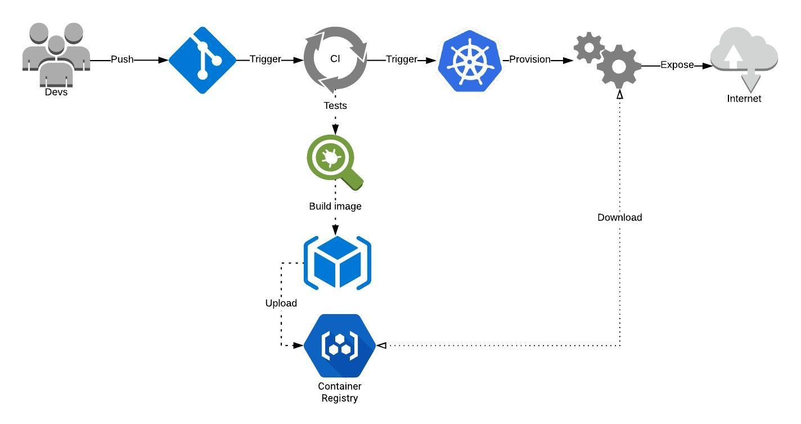
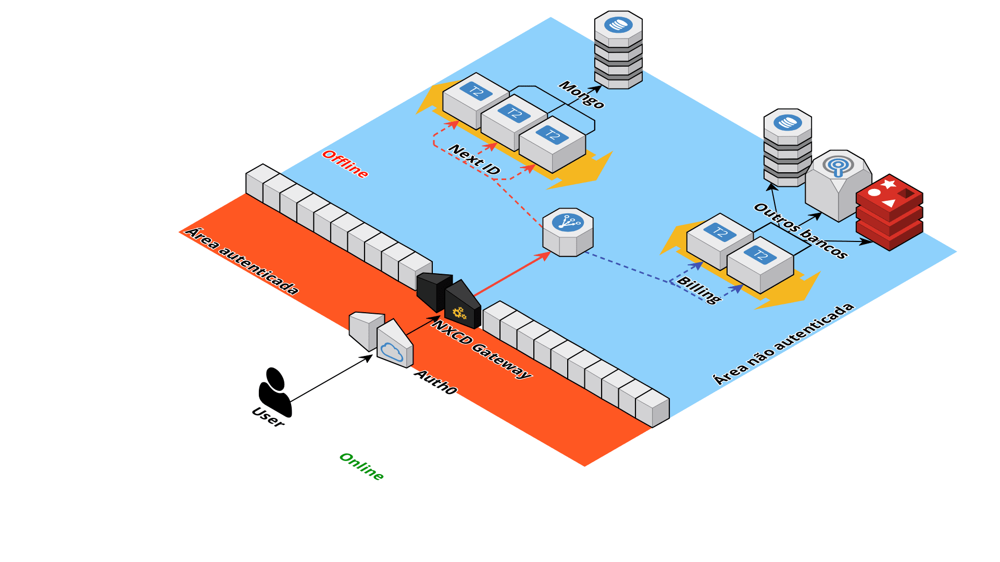

# Documentação de arquitetura

<!-- TOC -->

- [Documentação de arquitetura](#documentação-de-arquitetura)
  - [Sobre processos de desenvolvimento](#sobre-processos-de-desenvolvimento)
    - [Scrum](#scrum)
      - [Sprint Planning](#sprint-planning)
      - [Sprint Review](#sprint-review)
      - [Sprint Retrospective](#sprint-retrospective)
      - [Status de tarefas](#status-de-tarefas)
    - [Sobre versionamento](#sobre-versionamento)
      - [Funcionamento](#funcionamento)
        - [Fluxo de _bugfix_](#fluxo-de-_bugfix_)
      - [Convenções para números de versão](#convenções-para-números-de-versão)
        - [Patch](#patch)
        - [Minor](#minor)
        - [Major](#major)
        - [Exemplos](#exemplos)
  - [Sobre Estilos de código](#sobre-estilos-de-código)
    - [Arquivos de configuração](#arquivos-de-configuração)
      - [Git Ignore](#git-ignore)
      - [EditorConfig](#editorconfig)
      - [StandardJS](#standardjs)
      - [Prettier](#prettier)
  - [Sobre a arquitetura de código](#sobre-a-arquitetura-de-código)
    - [Estrutura de pastas](#estrutura-de-pastas)
    - [Camada de apresentação](#camada-de-apresentação)
    - [Camada de Serviço](#camada-de-serviço)
    - [Camada de dados](#camada-de-dados)
      - [Conexões](#conexões)
      - [Repositórios](#repositórios)
    - [Coluna de domínio](#coluna-de-domínio)
    - [Coluna de utilidades](#coluna-de-utilidades)
  - [Sobre infraestrutura e disposição do sistema](#sobre-infraestrutura-e-disposição-do-sistema)
    - [Infraestrutura](#infraestrutura)
    - [Mapa do Sistema](#mapa-do-sistema)
      - [NextGate](#nextgate)
      - [Billing](#billing)
      - [Next-ID](#next-id)

<!-- /TOC -->

## Sobre processos de desenvolvimento

O processo de desenvolvimento do sistema é baseado no modelo ágil, utilizando a metodologia Scrum.

### Scrum

O [Scrum](https://www.desenvolvimentoagil.com.br/scrum/) é uma metodologia baseada em *Sprints*. Assim como todas as metodologias ágeis, ele possui um modelo base para ser seguido mas que deve ser adaptado e alterado de time para time e de empresa para empresa, inclusive, é comumente dito que: "se você está usando o Scrum conforme o livro, provavelmente ele não vai funcionar".

O Scrum possui duas figuras importantes:

- **O P.O**: Geralmente é uma pessoa ligada ao negócio **e (mas não só)** à tecnologia como um todo. Na maioria dos casos é um funcionário com este cargo especificamente, porém, no nosso caso, o mais indicado para que ocupe esse cargo é ou o Fabrício ou o Juliano, devido a proximidade de ambos com os clientes e o conhecimento das funcionalidades do sistema.
- **O Scrum Master**: Pode ser qualquer pessoa do time que esteja ou não esteja trabalhando no projeto. O objetivo desta figura é proteger o tempo do time e o processo geral. Garantir que todos estão entendendo o processo do Scrum e também garantir que todos estão trabalhando dentro da metodologia. Será ele que irá tirar dúvidas de processo e também guiar o time durante a sprint. Este cargo pode ser fixo ou então se alternar entre os membros do time.

Além das figuras de organização, o Scrum também tem os chamados "rituais", que são reuniões que acontecem em momentos do projeto. Para falar delas primeiramente precisamos entender o que é uma **sprint** e também o que é um **épico**:

- **Sprint**: É um intervalo de tempo que, geralmente, dura de 7 a 14 dias. Uma sprint muito curta faz com que não seja possível a inclusão de tarefas muito longas e uma sprint muito longa torna o processo de *deploy* difícil de gerenciar. Uma vez que a sprint está em andamento, **não poderão ser adicionadas novas tarefas à mesma**, apenas removidas.
- **Épico ou Estória**: Um épico é uma tarefa grande, por exemplo "Criar tela de login", que será quebrada em N tarefas menores pela equipe de forma que fiquem pequenas o suficiente para serem feitas por uma única pessoa e independente o suficiente para que seja separada do resto da lista. Este tipo de tarefa só pode ser criada pelo P.O

Quando falamos de reuniões "rituais" temos algumas principais.

#### Sprint Planning

É o processo onde todos do time (incluindo o P.O e o Scrum Master) se reunem para realizar o planejamento da próxima sprint.

Ela geralmente acontece um dia depois da sprint anterior terminar (ou então no mesmo dia). Nesta reunião serão definidas todas as tarefas que serão passadas do *backlog* para tarefas ativas, é importante que as tarefas sejam bem especificadas e, na medida do possível, independentes umas das outras, de forma que todos do time possam realizar tarefas em paralelo ao invés de ter de esperar outros terminarem.

Uma planning **geralmente dura entre uma e três horas**, tentando ser o mais rápido possível.

#### Sprint Review

A review é realizada no dia da finalização de uma sprint. Será nesta reunião que todos os membros vão apresentar o que foi feito para o P.O poder comunicar aos usuários.

Individualmente, todas as tarefas devem ser mostradas e testadas como se um usuário as estivesse usando. Esta reunião geralmente **demora cerca de 1h30min**. Caso alguma das tarefas não esteja pronta ou então com defeito, ela voltará para o *backlog* para ser repriorizada na próxima planning.

#### Sprint Retrospective

Esta é uma reunião interna do time, que pode ou não ser necessária. Em times pequenos ela geralmente não se faz muito importante, pois será aonde o time irá conversar sobre o processo em si, nesta reunião o P.O não precisa estar presente, mas a presença do Scrum Master é importante.

A reunião não pode durar mais de 1h e, nela, os membros vão escrever o que foi bom na última sprint e os pontos de melhoria. Desta forma o processo pode melhorar na próxima sprint.

O intervalo de execução dessas reuniões geralmente é definido como **uma vez a cada 2 sprints** ou então 2 vezes por mês, pois executar este ritual muitas vezes acaba sendo improdutivo e não trazendo muitos problemas, mas demorar a executar também cria um problema por conta dos membros do time não lembrarem de sprints anteriores.

#### Status de tarefas

As tarefas no Scrum geralmente caem em 4 categorias distintas:

- **Backlog:** Aqui ficam todas as tarefas que podem ou não serem feitas. Todos os membros do time tem permissão de adicionar uma tarefa aqui, geralmente quem adiciona essas tarefas é o P.O nas chamadas **estórias ou épicos**.
- **To do:** Lista de tarefas que já foram retiradas do backlog e estão prontas para serem feitas **na sprint atual**. Tarefas de sprints anteriores não podem entrar no *to do* de uma nova sprint.
- **Doing:** Tarefas em progresso
- **Testing:** Tarefa com desenvolvimento finalizado mas ainda não testada, deverá ser testada **por uma pessoa que não desenvolveu a tarefa**
- **Blocked:** Tarefa que está finalizada (com ou sem testes) mas está bloqueada por algum motivo externo à equipe
- **Done:** Tarefas completamente finalizadas que vão ser arquivadas ao final da sprint

### Sobre versionamento

Estaremos utilizando o [Git Flow](https://www.atlassian.com/git/tutorials/comparing-workflows/gitflow-workflow) (com um cheat sheet [aqui](https://danielkummer.github.io/git-flow-cheatsheet/)). Um modelo de organização do repositório que é suportado por diversos sistemas como: [SourceTree](http://www.sourcetreeapp.com/) e [GitKraken](https://www.gitkraken.com/), mas também com [implementações em linha de comando](https://github.com/nvie/gitflow).

#### Funcionamento

Assim como o Scrum, vamos adaptar o modelo do Git Flow para funcionar de uma forma mais simples. Não vamos ter o branch `develop` e vamos fazer todos os desenvolvimentos no branch `release/nome-da-release`:

- Iniciamos somente com o branch `master`, dele clonamos um branch `release/nome-da-release`, de onde todos os demais branches `feature/nome-da-feature` serão clonados
- Ao iniciar uma nova feature, vamos clonar do branch `release/nome-da-release` o branch `feature/nome-da-feature`
- Uma vez que a funcionalidade terminar, ela será novamente mesclada ao branch `release/nome-da-release`
- Quando a sprint for terminada, vamos mesclar o branch `release/nome-da-release` no branch master (**isso significa que vamos publicar o branch em produção**)
  - Aqui será aonde vamos adicionar, atualizar e corrigir os números de versão
  - Também vamos tagear a release com seu nome
- Depois de mesclada, o branch da `release/nome-da-release` é removido do GitLab e um novo branch `release/nome-da-proxima-release` é criado a partir da `master`

> O branch `master` será **sempre** o branch da versão que está em produção no momento

> **Funcionamento do Git Flow original**
>
> O git flow original funciona da seguinte maneira:
>
> - Iniciamos com um *branch* de desenvolvimento, normalmente chamado de `develop`, todo o desenvolvimento novo será mesclado neste branch.
> - A cada nova funcionalidade (ou **feature**), um novo branch é criado a partir do `develop` seguindo a nomenclatura > `feature/nome-da-feature`, é neste branch que todo o desenvolvimento será feito
> - Uma vez que uma funcionalidade é terminada, ela é mesclada de volta no branch `develop`
> - Quando a sprint termina, temos que criar uma nova release, para isso vamos mesclar o branch `develop` em um novo branch chamado > `release/nome-da-release`
>   - Neste processo será aonde vamos adicionar, atualizar e corrigir os números de versão
>   - Aqui será aonde vamos realizar a criação das tags para esta release
> - Depois de finalizar a criação da release vamos fazer o *shipping* da mesma. Para isto vamos mesclar o branch `release/nome-da-release` de > volta no branch `develop` e também no branch `master`.

##### Fluxo de _bugfix_

Além do fluxo padrão de desenvolvimento de novas funcionalidades, temos o fluxo de correção de bugs, as chamadas `hotfixes`.

Para isto, vamos seguir os passos:

- Criamos um novo branch `hotfix/descrição-do-fix` a partir da branch `master`, **e não mais da `develop`**
- Realizamos a correção nesta branch
- Ao finalizar, mesclamos a branch nos branches `develop` e `master`
  - Aqui vamos criar uma tag para o branch master informando a descrição do fix

Então a publicação segue normalmente.

#### Convenções para números de versão

Vamos usar o [Semantic Versioning](http://semver.org), mas com algumas alterações nas regras.

##### Patch

O número de Patch é destinado __somente__ aos deploys em produção fora do tempo da sprint, ou seja, bugs e hotfixes. Sempre que tivermos que publicar alguma coisa em produção __durante__, __antes__ ou __depois__ de uma release, ou seja, fora da data especificada de deploy, vamos incrementar este número.

Ele também deve ser incrementado __para todos os deploys individualmente__, por dois motivos:

- Isto ajuda a manter o _track_ da quantidade de hotfixes que tivemos entre uma sprint e outra
- Atualiza a versão na master para que o Kubernetes possa fazer o download novamente e não usar o cache do cluster

##### Minor

Será o número da sprint do mês. Em geral, como temos até 4 semanas em um mês e nossas sprints são de duas semanas, este número não deve passar muito de 3.

Ele será incrementado somente nos merges __da release com a master__. Por exemplo, no mês de __Junho de 2018__, durante a primeira sprint do mês o número continuará `0`, mas, quando a publicação for realizada, o número deverá ser incrementado para `1`. Assim acontecerá na segunda sprint do mês, onde o número será incrementado para `2`, ao virar o mês, o número volta a ser `0`.

##### Major

O Major da versão conterá __sempre__ 4 dígitos, sendo estes os dois últimos dígitos do ano + o mês com dois dígitos, por exemplo:

Uma versão do mes de __Junho de 2018__ seria: `1806.0.0`

A versão Major só é atualizada quando há uma virada de mês, quando isto acontece, a Minor e a Patch são __zeradas__.

##### Exemplos

- Uma build da segunda sprint de Julho de 2018: `1807.2.0`
- Uma build da primeira sprint de Agosto de 2018 com 10 hotfixes implementados: `1808.1.10`

## Sobre Estilos de código

- Vamos utilizar o estilo pré-pronto [standardJS](https://standardjs.com/) como **linter**.

- [Prettier](https://prettier.io) como **formatter**.
- Vamos utilizar [PNPM](https://pnpm.js.org/) como gerenciador de dependências porque ele evita instalação de dependências duplicadas e também gera menos instalações de pacotes por gerar SymLinks ao invés de reinstalar tudo (leia a doc)
  - Principalmente para desenvolvimento local, uma vez que CI/CDs podem não ter suporte a este instalador
- Utilizamos o [TypeScript](https://www.typescriptlang.org/) como linguagem de programação pelos motivos abaixo:
  - Em um time grande, a tipagem estática do TS ajuda a manter a ordem do repositório
  - Podemos criar interfaces tanto para os parâmetros de entrada quanto para os dados de saída e também para os retornos de APIs
  - Podemos, facilmente, alterar o alvo de nossas builds para sistemas mais antigos, mais novos e também utilizar propostas ainda não implementadas pelo TC39 através do `tsconfig.json` usando o Babel

>  **Importante**
>
> Linters e formatters são coisas diferentes. Enquanto o Linter vai somente dizer aonde que o código está fugindo do estilo, o formatter irá, de fato alterar o estilo de código e salvar os arquivos.

### Arquivos de configuração

Todo projeto vai ter arquivos de configuração padrões, os chamados *dotfiles*, que são responsáveis por configurar nossas extensões e editores e devem ficar na raiz do projeto, juntamente com a pasta `.git`.

#### Git Ignore

Todo projeto deve ter um `.gitignore` que pode ser gerado [neste endereço](https://www.gitignore.io/api/vim,node,linux,macos,windows,visualstudiocode) e complementado depois. Ele vai prover os principais arquivos de *ignore* para os principais IDEs que usamos e a linguagem Node.

#### EditorConfig

O [EditorConfig](https://editorconfig.org) é um modelo de padronização de código em editores e IDEs, a grande maioria dos editores possuem um plugin para ler arquivos `.editorconfig` que ficam na raiz do projeto e aplicar suas regras ao código escrito em todos os arquivos:

**.editorconfig:**

```ini
[*]
end_of_line = lf
insert_final_newline = true

[*.js]
charset = utf-8
indent_style = space
indent_size = 2
trim_trailing_whitespace = true

[*.html]
charset = utf-8
indent_style = space
indent_size = 2
```

Como a maioria do time usa o [VSCode](https://code.visualstudio.com/), o plugin para ele está [no link da extensão](https://github.com/editorconfig/editorconfig-vscode)

#### StandardJS

Para o standard, vamos instalar **sempre**, a biblioteca *StandardJS* como *Dev Dependency* no NPM através de `pnpm i -D standard`.

Todo o projeto também terá um script de lint que poderá ser acessado usando `pnpm run lint` ou `npm run lint` que, basicamente, irá rodar `standard`. O ideal será rodar este comando antes de dar push para o repositório. Porém, se o desenvolvedor se esquecer, o CI irá fazer o trabalho.

#### Prettier

Vamos utilizar o Prettier para poder padronizar o modelo de desenvolvimento de código. Para isso, vamos executar `pnpm install --exact -D prettier`.

> Vamos utilizar `—exact` porque mudanças de versão do Prettier causam alterações de estilo no core do sistema e é recomendado utilizar a versão exata no `package.json`

Arquivo de configuração `.prettierrc` que ficará na raiz:

**.prettierrc:**

```json
{
  "tabWidth":2,
  "useTabs":false,
  "semi":false,
  "singleQuote":true,
  "trailingComma":"none",
  "bracketSpacing":true,
  "arrowParens":"always"
}
```

Descrição das regras do arquivo:

- Uma `TAB` equivale a 2 espaços
- Sempre vamos usar espaços ao invés de *tabs*
- Não haverá `;` no final das linhas
- Sempre usaremos `'` ao invés de `"`
- Não vamos usar `,` no final da última propriedade de objetos
- Em um objeto do tipo `{key:value}` vamos ter espaços entre chaves, ficando `{ key: value }`
- Toda arrow function do tipo `param => { … }` vai se tornar `(param) => { … }`

## Sobre a arquitetura de código

Estamos utilizando o modelo baseado em *Domain Driven Design*, com ou sem [Event Sourcing](https://martinfowler.com/eaaDev/EventSourcing.html).

Este modelo se baseia em 3 camadas base que se comunicam de forma *top-down*, ou seja, a camada mais superior irá interagir com a mais inferior, mas nunca o contrário.

Todo o cenário é baseado na imagem a seguir:


### Estrutura de pastas

A estrutura de pastas seguirá o modelo abaixo, mas você pode checar em tempo real acessando o [diretório de exemplo](./folder-structure):

```
project-x
    |   .dockerignore
    |   .editorconfig
    |   .envrc
    |   .envrc-sample
    |   .gitignore
    |   app-config.ts
    |   ci-config.yaml
    |   Dockerfile
    |   package.json
    |
    +---.git
    \---src
        |   index.ts
        |
        +---data
        |   +---connections
        |   |       mongo.ts
        |   |       sql-server.ts
        |   |
        |   \---repositories
        |           entity-x.ts
        |           entity-y.ts
        |
        +---domains
        |   |   domain-base-error.ts
        |   |   index.ts
        |   |
        |   +---entity-x
        |   |   |   entity.ts
        |   |   |   initial.state.ts
        |   |   |
        |   |   +---commands
        |   |   |       create.ts
        |   |   |       delete.ts
        |   |   |       update.ts
        |   |   |
        |   |   +---errors
        |   |   |       entity-x-error.ts
        |   |   |
        |   |   +---events
        |   |   |       entity-x-was-created.ts
        |   |   |       entity-x-was-deleted.ts
        |   |   |       entity-x-was-finished.ts
        |   |   |       entity-x-was-updated.ts
        |   |   |
        |   |   \---interfaces
        |   |           data.ts
        |   |           filter.ts
        |   |
        |   \---entity-y
        |       +---commands
        |       +---errors
        |       +---events
        |       \---interfaces
        +---libs
        |       cpf-validator.ts
        |       helper-abc.ts
        |
        +---presentation
        |   |   app.ts
        |   |   server.ts
        |   |
        |   \---routes
        |           route-a.ts
        |           route-b.ts
        |
        \---services
                entity-x.ts
                entity-y.ts
```

- `project-x`: É a pasta inicial que vai conter o nome do projeto, tudo estará dentro desta pasta
  - **Arquivos de estrutura**: Abaixo da raiz, no primeiro nível, vamos ter os dotfiles necessários para configuração de CI/CD, Docker e outras informações; aqui será aonde vamos ter o `package.json` e o `tsconfig.json`
  - `.env` ou `.envrc`: Variáveis de ambiente devem ficar em um arquivo `.envrc` para **execução local**, toda a execução em imagem teremos um CI que vai passar as variáveis de ambiente para o container. Todo `.envrc` deve ter um `.envrc-sample` com a lista das variáveis de ambiente daquela aplicação
  - `src`: Pasta que conterá todo o código fonte da aplicação
    - `index.ts`: É o *entrypoint* da aplicação, será nele que a aplicação vai começar
    - `data`: É a camada de dados da aplicação, conforme especificada [em sua seção](#camada-de-dados)
      - `connections`: Aqui ficarão todos os arquivos referentes a conexões com bancos de dados e outras fontes
      - `repositories`: Aqui ficarão os manipuladores dos clientes de fontes de dados existentes em `connections`, esta será a pasta que conterá os arquivos que serão consumidos pela [camada de serviços](#camada-de-serviço)
    - `domains`: Será a coluna de domínio, conforme especificada [em sua seção](#coluna-de-dominio)
      - `index.ts`: Retornará um objeto com todas as entidades
      - `domain-base.error.ts`: O erro base do domínio que todas as entidades devem estender
      - `<entity-x>`: Cada pasta dentro da camada de domínio terá o nome de uma entidade deste domínio
        - `entity.ts`: Toda entidade terá um arquivo `entity.ts` que será o arquivo que juntará todos os comandos, eventos e erros. Em teoria, será o local aonde as demais camadas irão buscar a instância do domínio em si
        - `initial.state.ts`: Toda entitade tem um estado inicial que será colocado neste arquivo
        - `commands`: Comandos são as instruções necessárias para se manipular esta entidade, aqui ficarão os métodos e funções que retornam os arrays de eventos (no caso de event-sourcing) necessários para criar tal entidade
        - `errors`: Aonde ficarão as classes de erro da entidade, todas devem estender o arquivo base de erro
        - `events`: Somente utilizado no caso de event-sourcing, será aonde estarão armazenados as ações que podem ser executadas sobre esta entidade em forma de eventos, todos os arquivos devem ter o nome `<nome-da-entidade>-descrição-do-evento.ts`
        - `interfaces`: Aqui ficarão as interfaces do TypeScript para tal entidade, não só as interfaces mas também, se necessários, Enums e qualquer outra estrutura de definição de tipos
    - `libs`: Aqui ficarão os arquivos de bibliotecas, helpers e qualquer outro arquivo que sirva de repositório de utilidades
    - `presentation`: A camada de apresentação ficará descrita aqui, conforme [descrição de sua seção](#camada-de-apresentação)
      - `app.ts`: Neste arquivo serão carregadas todas as rotas da aplicação, exportará o modelo base de um webserver
      - `server.ts`: Irá receber `app.ts` e irá iniciar um servidor web
      - `routes`: Aqui ficarão os handlers das rotas, toda a rota deverá ter o nome `<verbo>-descrição.ts`
    - `services`: Camada de serviços conforme [descrição](#camada-de-serviço)
      - `<entity-x>`: Para cada entidade em `domains` temos que ter um arquivo aqui, que será o responsável por se comunicar com a camada de dados e manipular os dados no banco seguindo o comando que for executado pelo domínio

### Camada de apresentação

A camada de apresentação será responsável por receber as chamadas do [NextGate](#nextgate) e encaminhar para a camada de serviços.

Esta camada também vai ser responsável por receber as respostas da camada de serviço e apresentar para o usuário em forma de JSON ou qualquer outro content type.

Além disso, todos os erros que vierem das camadas inferiores, sejam eles relativos ou não à camada de apresentação, serão tratados e exibidos pelo usuário nesta mesma camada.

### Camada de Serviço

A camada de serviço será responsável por fazer a comunicação com todo o resto da arquitetura. Cada serviço receberá pelo menos uma instancia de um repositório da camada de dados, podendo receber também outros serviços.

Os serviços serão chamados a partir da API que está na camada de apresentação e terão acesso ao *domain bus* para instanciar novas entidades.

### Camada de dados

A camada de dados é a responsável pela comunicação com fontes externas de dados (APIs, DBs).

#### Conexões

Nesta camada estará a pasta `connections` que será um agregado de conexões de bancos de dados que podem ser utilizadas.

Aqui estarão os arquivos que gerarão e conectarão com os bancos de dados, mas não vão realizar nenhum tipo de operação.

#### Repositórios

Os repositórios serão os manipuladores dos clientes de bancos de dados localizados na pasta de conexões descrita acima. Serão eles que vão realizar as operações no banco de dados e retornar os dados propriamente ditos.

### Coluna de domínio

A coluna de domínio será aonde estará descrito, de fato, o domínio da aplicação com suas entidades, eventos, comandos, regras, erros e afins. Ela é responsável por representar os objetos de negócio dentro do código.

### Coluna de utilidades

Conterá bibliotecas e helpers que podem ser utilizados em toda a aplicação independente da camada.

## Sobre infraestrutura e disposição do sistema

### Infraestrutura

O fluxo de infraestrutura não é muito bem definido em detalhes porque ainda não foi totalmente pensado, inicialmente pensamos em utilizar um modelo como o abaixo:



1. Desenvolvedores vão codificar a aplicação
2. O push no repositório vai ativar o build no CI
3. CI irá rodar os testes automatizados
4. Se todos os testes passarem, o CI irá construir a imagem
5. Depois de construída, vamos enviar a imagem para ser armazenada em um registry para que possamos baixar estas imagens individualmente depois e testar versão a versão
6. Após o término da build da imagem, o CI irá iniciar um deploy na infraestrutura do Kubernetes

### Mapa do Sistema

O sistema ficará organizado da seguinte forma:



Teremos um total de três aplicações:

#### NextGate

Será o gateway pelo qual todas as mensagens irão trafegar suas responsabilidades incluem:

  - Autorizar escopos de usuário baseado em um token recebido pelo serviço de autenticação externo Auth0
  - Verificar Rate Limits e concorrências dos clientes se comunicando com as aplicações de cobrança
  - Fazer o proxy entre a requisição das áreas logadas e as áreas não logadas
  - Contar números de requisições e processos simultâneos, inserindo os dados de telemetria nos bancos de dados

Se alguma das regras não passarem, a request não será completada

#### Billing

A aplicação de cobrança será a inteligência por trás dos dados brutos de acesso e uso de aplicações do usuário. Esta aplicação:

- Quando esta API está sendo utilizada
- Quanto tempo de uso cada usuário está tendo
- Quantidade de chamadas de uma API
- Calcular preços baseados em todos esses dados

O NextGate se comunicará com esta aplicação para poder descobrir se um usuário excedeu ou não sua cota de uso.

> Talvez seja necessário quebrar esta aplicação em algumas partes para ter responsabilidades mais isoladas.

#### Next-ID

Aplicação propriamente dita